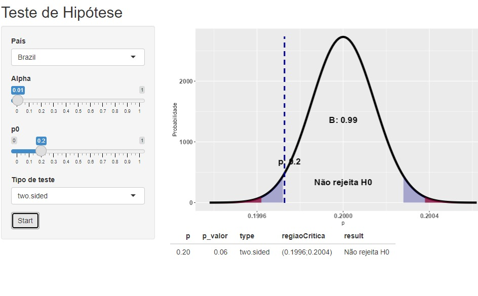

## Introdução

A detecção de fraudes financeiras representa um desafio crítico para instituições financeiras e consumidores em um cenário cada vez mais digitalizado. Transações fraudulentas podem acarretar prejuízos financeiros substanciais, erosão da confiança e impactos na reputação de empresas e organizações. Com a crescente complexidade das fraudes e o aumento das transações digitais, torna-se essencial o desenvolvimento de ferramentas analíticas e preditivas que auxiliem na identificação de padrões suspeitos.

A base de dados analisada neste trabalho apresenta informações detalhadas sobre transações financeiras, incluindo variáveis relacionadas a país, distância do local de compras, tipo de comerciante, canal de acesso e dispositivos utilizados. Esses dados fornecem um ambiente propício para a exploração de padrões de fraude, permitindo uma abordagem detalhada e fundamentada para a construção de um aplicativo em Shiny que exponha os principais resultados e análises.

Este estudo propõe uma análise multifacetada das fraudes, abordando:  
1. **Proporção de fraudes por país**, utilizando testes de hipótese para investigar diferenças estatísticas significativas.  
2. **Análises descritivas e exploratórias** de padrões de fraude com filtros como distância, categoria e tipo de comerciante, e se a transação envolveu um cartão presente.  
3. **Avaliação de canais de acesso**, considerando variáveis como dispositivo, categoria e tipo de comerciante, bem como o nome do estabelecimento.  
4. **Modelagem preditiva baseada em aprendizado de máquina**, com o objetivo de compreender o comportamento das fraudes e prever quando uma transação tem maior probabilidade de ser fraudulenta.

A justificativa para esta abordagem reside na relevância prática e teórica do tema. Identificar padrões de fraude e desenvolver modelos preditivos eficazes não apenas reduz os prejuízos financeiros, mas também fortalece a confiança no sistema financeiro. Além disso, a combinação de métodos estatísticos e aprendizado de máquina oferece uma perspectiva robusta e inovadora para o enfrentamento do problema.


```{r}
library(tidyverse)
head(mtcars)

```

## Materiais e Métodos

Escreve aí, Vini-chan


## Resultados e discussões 




Três análises descritivas foram realizadas: (1) um gráfico de barras mostrando a proporção de fraudes por hora do dia, evidenciando horários de maior risco; (2) um gráfico de barras laterais ranqueando os países pelo número de fraudes e não fraudes, destacando regiões mais suscetíveis; e (3) um histograma categorizando fraudes e não fraudes por tipo de comerciante, identificando setores mais vulneráveis. Além disso, conduzimos um teste de hipótese para avaliar a relação entre a taxa de fraudes e países, utilizando o teste qui-quadrado, que revelou associações significativas.
Três análises descritivas foram realizadas: 
(1) um gráfico de barras mostrando a proporção de fraudes por hora do dia, evidenciando horários de maior risco; 
(2) um gráfico de barras laterais ranqueando os países pelo número de fraudes e não fraudes, destacando regiões mais suscetíveis; 
(3) um histograma categorizando fraudes e não fraudes por tipo de comerciante, identificando setores mais vulneráveis. 
Além disso, conduzimos um teste de hipótese para avaliar a relação entre a taxa de fraudes e países, que revelou associações significativas.

```{r}
#| label: carregando os pacotes
require(data.table)
require(tidyverse)
require(magrittr)
```
## Conclusão
Como etapa avançada, foi implementado um modelo de machine learning para prever a ocorrência de fraudes, utilizando algoritmos de classificação.
Concluímos que padrões temporais, regionais e setoriais são determinantes para fraudes, e que ferramentas analíticas e preditivas, como as desenvolvidas neste estudo, são essenciais para mitigar riscos e otimizar decisões.


